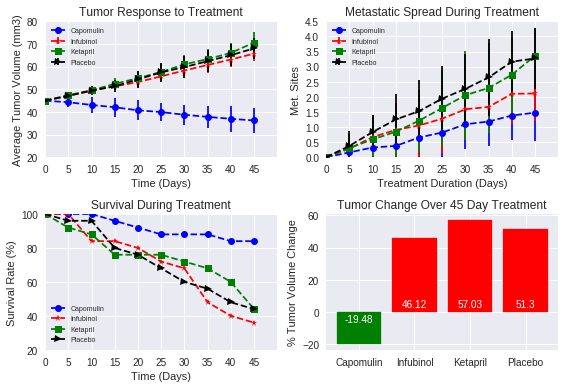

## **Pymaceuticals Inc**  

**Analysis**
* Mice treated with Capomulin exhibit significantly reduced tumor volume compared to the control group (those treated with Placebo). And mice treated with other two drugs (Infubinol and Ketapril) do not show any significant effects compared to the control group.  

*  Mice treated with Capomulin exhibit higher survival rate than those treated with other two drugs and Placebo.

* The effect of Capomulin on tumor volume reduction is linearly associated with the days of treatment within 45 days period.

* Some comments: 1) the experiment mice should be grouped by gender, since some tumor is gender sensitive; 2) tumor volume should be normalized by mouse body weight.


```python
import pandas as pd
import numpy as np
import matplotlib.pyplot as plt
```


```python
# Loading data

m_drug_data=r'/home/shoujun/Desktop/bootcamp/GW-Bootcamp/Homework#5_Matplotlib/mouse_drug_data.csv'
cli_data=r'/home/shoujun/Desktop/bootcamp/GW-Bootcamp/Homework#5_Matplotlib/clinicaltrial_data.csv'

drug_list=['Capomulin', 'Infubinol', 'Ketapril', 'Placebo']

df_mouse=pd.read_csv(m_drug_data)
df_mouse=df_mouse.loc[df_mouse['Drug'].isin(drug_list),:].drop_duplicates()
df_cli=pd.read_csv(cli_data).drop_duplicates()
df=df_mouse.merge(df_cli)

df.head()
```


<div>
<style>
    .dataframe thead tr:only-child th {
        text-align: right;
    }

    .dataframe thead th {
        text-align: left;
    }

    .dataframe tbody tr th {
        vertical-align: top;
    }
</style>
<table border="1" class="dataframe">
  <thead>
    <tr style="text-align: right;">
      <th></th>
      <th>Mouse ID</th>
      <th>Drug</th>
      <th>Timepoint</th>
      <th>Tumor Volume (mm3)</th>
      <th>Metastatic Sites</th>
    </tr>
  </thead>
  <tbody>
    <tr>
      <th>0</th>
      <td>q119</td>
      <td>Ketapril</td>
      <td>0</td>
      <td>45.000000</td>
      <td>0</td>
    </tr>
    <tr>
      <th>1</th>
      <td>q119</td>
      <td>Ketapril</td>
      <td>5</td>
      <td>47.864440</td>
      <td>0</td>
    </tr>
    <tr>
      <th>2</th>
      <td>q119</td>
      <td>Ketapril</td>
      <td>10</td>
      <td>51.236606</td>
      <td>0</td>
    </tr>
    <tr>
      <th>3</th>
      <td>n923</td>
      <td>Ketapril</td>
      <td>0</td>
      <td>45.000000</td>
      <td>0</td>
    </tr>
    <tr>
      <th>4</th>
      <td>n923</td>
      <td>Ketapril</td>
      <td>5</td>
      <td>45.824881</td>
      <td>0</td>
    </tr>
  </tbody>
</table>
</div>


```python
# Set plot

plt.style.use('seaborn')
fig, ax=plt.subplots(2,2)
mark_list=['--ob','--*r','--sg','-->k']
```


```python
# Creating a scatter plot that shows how the tumor volume changes over time for each treatment

df_vol=df[['Timepoint','Drug','Tumor Volume (mm3)' ]].copy()
df_vol_avg=df_vol.pivot_table('Tumor Volume (mm3)', 'Timepoint','Drug')
df_vol_std=df_vol.pivot_table('Tumor Volume (mm3)', 'Timepoint', 'Drug',
                              aggfunc='std')

for i in range(4):
    ax[0,0].errorbar(df_vol_avg.index, df_vol_avg.loc[:,drug_list[i]],
                     yerr=df_vol_std.loc[:,drug_list[i]],fmt=mark_list[i],
                     label=drug_list[i])

ax[0,0].set_xbound(lower=0, upper=50)
ax[0,0].set_ybound(lower=20,upper=80)
ax[0,0].set_title('Tumor Response to Treatment')
ax[0,0].set_xlabel('Time (Days)')
ax[0,0].set_ylabel('Average Tumor Volume (mm3)')
ax[0,0].set_xticks(range(0,50,5))
ax[0,0].legend(fontsize='x-small', loc='upper left')
```


    <matplotlib.legend.Legend at 0x7f59a829bb38>


```python
# Creating a scatter plot that shows how the number of metastatic (cancer spreading) sites changes
# over time for each treatment.

df_meta=df[['Timepoint','Drug','Metastatic Sites']].copy()
df_meta_avg=df_meta.pivot_table('Metastatic Sites', 'Timepoint','Drug')
df_meta_std=df_meta.pivot_table('Metastatic Sites', 'Timepoint', 'Drug',
                              aggfunc='std')

for i in range(4):
    ax[0,1].errorbar(df_meta_avg.index, df_meta_avg.loc[:,drug_list[i]],
                     yerr=df_meta_std.loc[:,drug_list[i]],fmt=mark_list[i],
                     label=drug_list[i])

ax[0,1].set_xbound(lower=0, upper=50)
ax[0,1].set_ybound(lower=0.0,upper=4.5)
ax[0,1].set_title('Metastatic Spread During Treatment')
ax[0,1].set_xlabel('Treatment Duration (Days)')
ax[0,1].set_ylabel('Met. Sites')
ax[0,1].set_xticks(range(0,50,5))
ax[0,1].set_yticks(np.arange(0,5,0.5))
ax[0,1].legend(fontsize='x-small', loc='upper left')
```


    <matplotlib.legend.Legend at 0x7f59a8289b38>


```python
# Creating a scatter plot that shows the number of mice still alive through the course of treatment (Survival Rate)

df_surv=df[['Timepoint','Drug','Mouse ID']].copy()
df_surv_count=df_surv.pivot_table('Mouse ID', 'Timepoint','Drug', aggfunc='count')
df_surv_perc=df_surv_count/df_surv_count.iloc[0,:]*100

for i in range(4):
    ax[1,0].plot(df_surv_perc.index, df_surv_perc.loc[:,drug_list[i]],
                mark_list[i],label=drug_list[i])

ax[1,0].set_xbound(lower=0, upper=50)
ax[1,0].set_ybound(lower=20,upper=100)
ax[1,0].set_title('Survival During Treatment')
ax[1,0].set_xlabel('Time (Days)')
ax[1,0].set_ylabel('Survival Rate (%)')
ax[1,0].set_xticks(range(0,50,5))
ax[1,0].legend(fontsize='x-small', loc='lower left')
```


    <matplotlib.legend.Legend at 0x7f59a821c898>


```python
# Creating a bar graph that compares the total % tumor volume change for each drug across the full 45 days.

df_volc=df[['Timepoint','Drug','Tumor Volume (mm3)' ]].copy()
df_volc_avg=df_volc.pivot_table('Tumor Volume (mm3)', 'Timepoint','Drug')
df_volc_change=(df_volc_avg.iloc[-1,:]/df_volc_avg.iloc[0,:]-1)*100

xtick=np.arange(len(df_volc_change.index))
barlist=ax[1,1].bar(xtick, df_volc_change)

for i in range(4):
    if df_volc_change[i]<0:
        barlist[i].set_color('g')
    else:
        barlist[i].set_color('r')

ax[1,1].set_title('Tumor Change Over 45 Day Treatment')
ax[1,1].set_ylabel('% Tumor Volume Change')
ax[1,1].set_xticklabels(['_']+list(df_volc_change.index))

ax[1,1].text(0, -6, str(df_volc_change[drug_list[0]].round(2)), ha='center', color='white')
for i in range(1,4):
    ax[1,1].text(i, 3, str(df_volc_change[drug_list[i]].round(2)), ha='center',color='white')
```


```python
# Show plot

plt.tight_layout()
plt.show()
```



