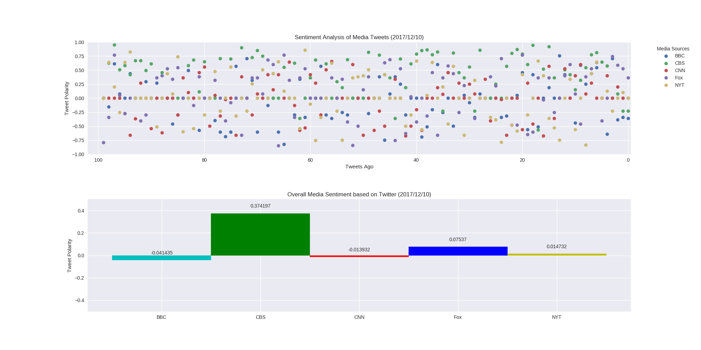

**Analysis**  
* All 5 media sources exhibit neutral sentiment.
* CBS posts tweets less frequently than other media sources.
* Fox posts tweets more frequently than other media sources.

**Python Codes:**  
```
import pandas as pd
import numpy as np
import matplotlib.pyplot as plt
import tweepy
from vaderSentiment.vaderSentiment import SentimentIntensityAnalyzer
import datetime

def get_tweets(user_name, count=100):  
    return api.user_timeline(user_name, count=count)

def tweets_to_df(tweets):
    timestamp=[]
    name_id=[]
    text=[]
    for tweet in tweets:
        timestamp.append(tweet['created_at'])
        name_id.append(tweet['user']['screen_name'])
        text.append(tweet['text'])
    df=pd.DataFrame({'created_at':timestamp,
                     'screen_name':name_id,
                     'text':text})
    return df

def add_converted_time(df):
    time=[]
    for raw_time in df['created_at']:
        converted_time= datetime.datetime.strptime(raw_time, "%a %b %d %H:%M:%S %z %Y")
        time.append(converted_time)
    df['converted_time']=time
    df.sort_values(by=['converted_time'], inplace=True)
    return df

def add_scores(df):
    score_name=('compound','neg','pos','neu')
    score=([],[],[],[])
    for text in df['text']:
        vs=analyzer.polarity_scores(text)
        for i in range(len(score_name)):
            score[i].append(vs[score_name[i]])
    for i in range(len(score_name)):
        df[score_name[i]]=score[i]
    return df

#Set params
analyzer = SentimentIntensityAnalyzer()

consumer_key='sP7RxK8b1MI2jSz0oG4d0jvNW'
consumer_secret='EUjv07IfT5d0sLaRAvG9qBgSew4xQheIwNMQbdHFe8mYZtQsyn'
access_token='104740161-HT4boK0Fyh352PWdzaEtjaZILNJI3DEMm0sYLtMY'
access_token_secret='8yMWItCYF4c082dyRbUepSeM14X5ZW3jAbh66XMSgtzBE'

auth = tweepy.OAuthHandler(consumer_key, consumer_secret)
auth.set_access_token(access_token, access_token_secret)
api = tweepy.API(auth,parser=tweepy.parsers.JSONParser())

#Create dataframes
id_tup=('@BBCNews', '@CBS', '@CNN', '@FoxNews', '@nytimes')
df_list=[]
for name in id_tup:
    tweets=get_tweets(name)
    df=tweets_to_df(tweets)
    df=add_converted_time(df)
    df=add_scores(df)
    df_list.append(df)

#Write df to csv
file_name=('BBC.csv','CBS.csv','CNN.csv','Fox.csv','NYT.csv')
for i in range(len(file_name)):
    df_list[i].to_csv(file_name[i])


#Make figures1
plt.style.use('seaborn')
fig,ax=plt.subplots(2,1, figsize=(20,10))
fig.subplots_adjust(hspace=0.4)

label_list=['BBC','CBS','CNN','Fox','NYT']

for i in range(len(label_list)):
    ax[0].plot(df_list[i].index,df_list[i]['compound'],'o',label=label_list[i])

date=datetime.datetime.now().strftime("%Y/%m/%d")
ax[0].set_title('Sentiment Analysis of Media Tweets ('+date+')')
ax[0].set_xlabel('Tweets Ago')
ax[0].set_ylabel('Tweet Polarity')
ax[0].set_xlim(102,-0.5)
ax[0].set_xticks(np.arange(0,110,20))
ax[0].set_ybound(lower=-1,upper=1)
ax[0].legend(bbox_to_anchor=(1.04,1),loc="upper left", title='Media Sources')

#Make figure2
combined_df=pd.concat(df_list)
df_score=combined_df.groupby('screen_name').aggregate({'compound':'mean'})

xtick=np.arange(len(df_score.index))
bar_list=ax[1].bar(xtick,df_score['compound'],width=1.0)

ax[1].set_title('Overall Media Sentiment based on Twitter ('+date+')')
ax[1].set_ylabel('Tweet Polarity')
ax[1].set_ybound(lower=-0.5,upper=0.5)
ax[1].set_xticklabels(['']+label_list, ha='center')
color_list=['c','g','r','b','y']
for i in range(len(df_score.index)):
    bar_list[i].set_color(color_list[i])
    ax[1].text(i, df_score['compound'][i]+0.05,
                   str(df_score['compound'][i]),ha='center')

plt.savefig('result.png')
plt.show()
```

**Result Plots:**  
  
